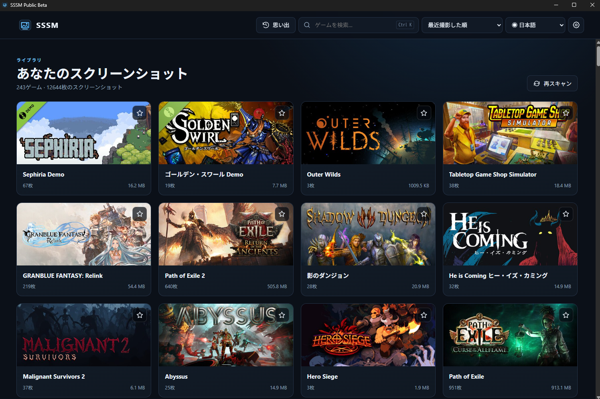
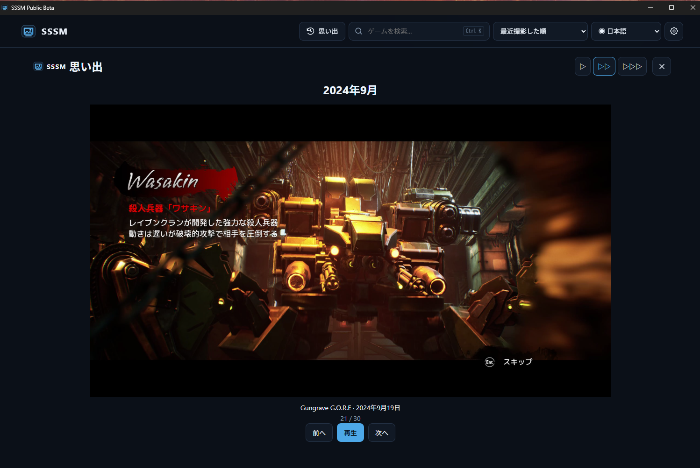
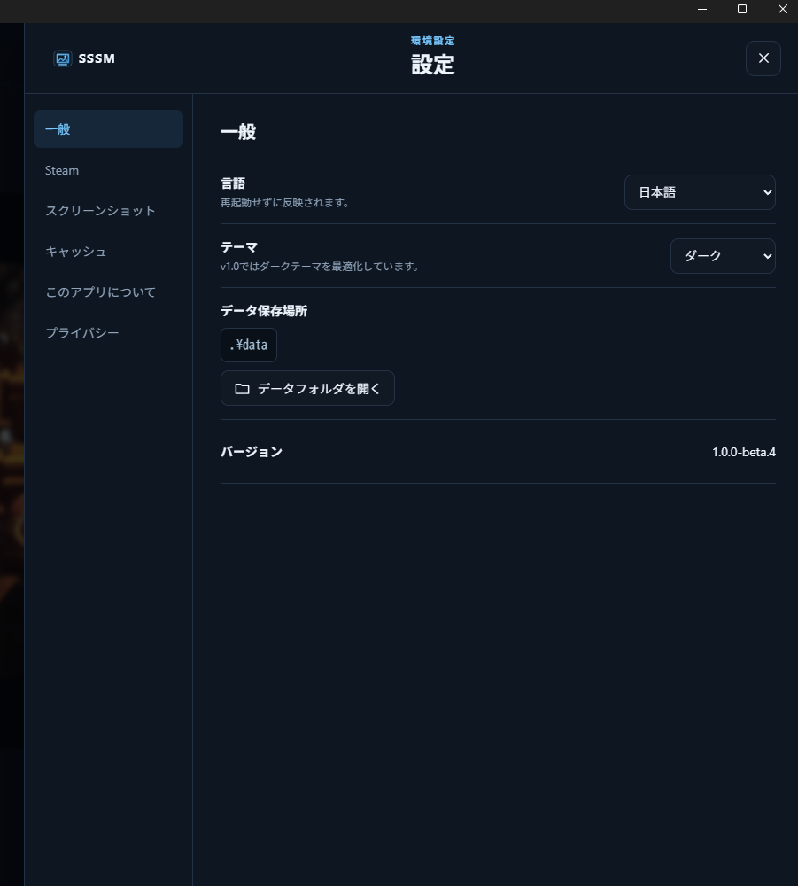

# SSSM - Steam Screenshot Manager

Steamのスクリーンショットを、もっと手軽に見返そう。

[English](README.md)

### [⬇ SSSM Public Betaをダウンロード](https://github.com/lg-dev-jp/SSSM-Steam-Screenshot-Manager/releases)

無料。広告なし。トラッキングなし。Portable。アカウント不要。

## 概要

Steamスクリーンショットをゲーム別・日付別に見返すためのWindowsアプリです。このPublic Betaの公開リポジトリは配布物とドキュメント用であり、ソースコードは公開していません。

## 主な機能

- Steam自動検出、複数ローカルSteamアカウント
- ゲーム一覧、検索、お気に入り、並べ替え
- F12などで撮影した新しいスクリーンショットのリアルタイム反映
- 日付別ギャラリー、スクロール中の日付表示、新しい順／古い順
- 複数ゲーム・複数年を楽しめるMemoriesとスライドショー速度調整
- 画像ビューア、クリップボードコピー、フォルダーを開く、ごみ箱削除
- Hidden Games、一時的な非表示ゲーム表示、Streamer Mode
- 言語別ゲームタイトル・画像とキャッシュ
- 保存済みゲーム一覧からの高速起動と、バックグラウンドでのフォルダー確認
- 設定・画像・ログ・更新ファイルのPortable保存
- GitHub Releasesによる更新

「非表示ゲームを表示」がONでもMemoriesには非表示ゲームを出しません。Streamer ModeはSSSM内の個人情報表示をマスクしますが、画像の内容やWindowsの外部ダイアログは隠しません。

## スクリーンショット

### Steamの思い出をもう一度

Memoriesでは、過去のゲームや年月のスクリーンショットをスライドショーで見返せます。

### シンプルなPortable設定

設定やアプリデータはPortable環境内にまとめて保存されます。

## 対応言語

English、日本語、简体中文、繁體中文、Русский、Español、Português (Brasil)、Deutsch、한국어。

## 動作環境

- Windows 10/11 x64
- Microsoft Edge WebView2 Runtime（x64）
- Microsoft .NET Framework 4.8以上（x64対応。4.8.1も利用可能）。現在の.NET / .NET Desktop Runtimeでは代用できません。
- Portable版の利用者はPythonのインストール不要。SSSMのインストーラーも不要です。

これはPublic Betaです。未署名アプリのため、初回にWindows SmartScreenの警告が表示される場合があります。公式配布元とSHA-256を確認したうえで実行を判断してください。

## インストール

1. [公式GitHub Releases](https://github.com/lg-dev-jp/SSSM-Steam-Screenshot-Manager/releases)からPortable ZIPをダウンロードします。
2. ZIP全体を書き込み可能なフォルダーへ展開します。
3. `SSSM_Portable`フォルダーを開き、`SSSM.exe`（`SSSM_Portable/SSSM.exe`）を起動します。

`SSSM.exe`、`SSSMUpdater.exe`、`SSSM.exe.config`、`_internal`は同じPortableフォルダー内のまま使用してください。Steam録画・動画には対応していません。

## Portableデータ

EXE横の`data/`へ設定、お気に入り、非表示設定、ゲーム情報、画像、ログ、WebViewプロファイル、更新ファイルを保存します。移動時はフォルダー全体を移してください。SSSM自身はAppData、ProgramData、Windows Temp、Registryを永続データ保存先にしません。WindowsやWebView2自身のOS内部動作は別です。

## プライバシー

広告・トラッキングなし。SSSMアカウントやSteam API keyは不要で、Steamログイン情報も要求しません。スクリーンショットはPC内に残り、SSSM独自サーバーへアップロードしません。ゲーム情報・画像の取得にはSteamへのHTTPS通信を使い、キャッシュで繰り返し通信を減らします。更新確認・ダウンロードにはGitHubへのHTTPS通信が発生します。通信できなくてもローカル画像を閲覧できます。ログにはローカルパスやアカウント名が含まれる場合があるため、共有前に確認してください。

## 更新

Settings > Aboutの「更新を確認」からGitHub Releasesを確認できます。自動確認は約24時間に1回で、Steam閲覧を妨げません。Beta/RC版はPrereleaseも候補にし、Stable版は除外します。公開済みReleaseがない場合の自動確認は静かに終了します。

更新ファイルは`data/updates`へ保存します。SHA-256検証と展開の後、SSSM終了を待ち、`data/`を保持してアプリファイルだけを交換し、再起動します。置換失敗時にはロールバックを試み、バックアップを保持します。ダウンロード・検証失敗時は既存アプリを変更しません。Beta更新前にはバックアップを推奨します。SHA-256は破損検知であり、独立した発行者署名ではありません。

手動更新はSSSMを終了し、新ZIPを別フォルダーへ展開してから旧版の`data/`をコピーしてください。新しい版の動作確認まで旧フォルダーを保持してください。

## トラブルシューティング

- Steamを検出できない場合はSettingsでSteamフォルダーを選択するか、画像フォルダーを追加してください。
- 起動に失敗する場合はWebView2 Runtimeと、ZIP全体を展開した書き込み可能なフォルダーを確認してください。既存のダウンロードファイル起動対策のため、`SSSM.exe.config`をEXE横へ保持します。Windowsのセキュリティ設定を全体的に無効化しないでください。
- Steamの一時制限中はキャッシュを保持し、表示された待機時間の後に自動再開します。
- 更新失敗時は既存版の継続利用または手動更新が可能です。`data/logs`と`data/updates/updater.log`を確認し、共有時は個人情報を除いてください。

## フィードバック

不具合報告・フィードバックは[公式GitHubリポジトリのIssues](https://github.com/lg-dev-jp/SSSM-Steam-Screenshot-Manager/issues)へお願いします。SSSMのバージョンと再現手順を添え、ログやスクリーンショットから個人情報を取り除いてください。

## 配布について

SSSMは無料で利用できます。ソースコードは現在公開していません。[公式GitHubリポジトリ](https://github.com/lg-dev-jp/SSSM-Steam-Screenshot-Manager)からのみダウンロードしてください。再配布は禁止します。改変・再パッケージされた非公式Buildはサポート対象外です。著作権はLGに帰属します。第三者コンポーネントの完全なライセンス表記はPortable ZIP内の`THIRD_PARTY_NOTICES.md`に同梱しています。

## 支援について

SSSMは広告・トラッキングなしの無料ソフトウェアです。今後も開発を続けるための任意の支援方法を、将来的に追加する場合があります。
